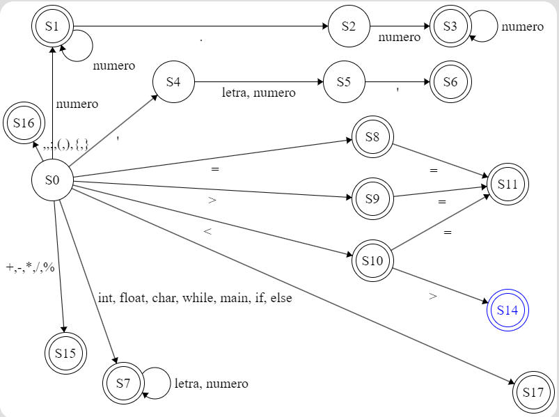

# Expressões Regulares (Analíse Léxica)

## Aqui serão definidas as expressões para identificação de tokens

### Obs.: Para facilitar a escrita iremos utilizar algumas atribuições básicas tais como:

- letra => [a-z]
- numero => [0-9]
- opRelacional => (>|<|=|<=|>=|==|<>)
- opAritmetico => (+|-|*|/|%)
- opAtribuicao => (=)
- caracterEspecial => (,|;|(|)|}|{)
- palavrasReservadas => (int|float|char|while|main|if|else)

| Tipo | Expressão regular |
| ------| ------|
| Inteiro | (numero)+ |
| Real | (numero)+((.)(numero))* |
| Char | (')(numero|letra)(') |
| Identificador | (letra)(numero|letra)* |
| Operador Relacional | opRelacional |
| Operador Aritmético | opAritmetico |
| Operador Atribuição | opAtribuicao |
| Caracter Especial | caracterEspecial |
| Palavras Reservadas | palavrasReservadas |

Inteiro e Real

Char

Identificador

Operador Relacional

Operador aritmético

Operador atribuição

Caracter Especial

Palavras reservadas

Automato completo e refinado

